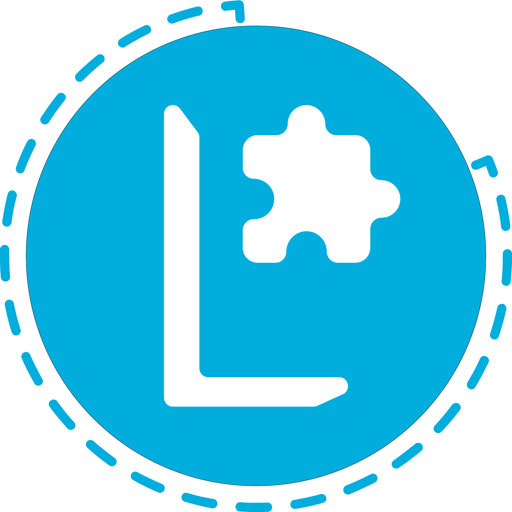

## Lua MTLibrary
*logic and utility-focused lua classes written in [Moonscript](https://github.com/leafo/moonscript) [with bindings for [LÖVE2D](https://github.com/love2d/love)]*

## Module Contents
`MTLibrary.`
- `logic.`
  - `Container` : `class`
    - `new` : `function(members)`
      - Inserts each (non-nil) key-value from `members` into the `Container`'s table
    - `+` : `function(left, right)`
      - Concatenates the (right) additive to the `Container` table
    - `call` : `function(member, ...)`
      - Searches the `Container` for key `member` and *returns or calls it* with `...` as arguments
    - `forEach` : `function(doFunc)`
      - Calls `doFunc(k) for i, k in @members`
    > Efficient storage object for logical entities
- `math.`
  - `sigmoid` : `function(x)`
    > returns `(1 / (1 + math.exp(-x)))`
  - `Dyad` : `class`
    - `new` : `function(x, y)`
    > 2-float object, representing a position
    - `lerp` : `function(t)`
    > returns the linear interpolation between `x, y` at `t`
  - `Tetrad` : `class`
    - `new` : `function(x, y, vX, vY)`
    > 4-float object, additionally representing velocity
    - `impulse` : `function(angle, force)`
    - `update` : `function(deltaTime)`
  - `Hexad` : `class extends Tetrad`
    > 6-float object, additionally representing rotation & rotational velocity
    - `update` : `function(deltaTime)`
  - `Octad` : `class extends Hexad`
    > 8-float object, additionally representing dimension & dimensional velocity
    - `update` : `function(deltaTime)`
  - `Shape` : `class`
    > Abstract class for shapely facilities.
  - `shapes.`
    - `Circle` : `class`
    - `Line` : `class`
    - `Rectangle` : `class`
    - `Polygon` : `class`
  - `Matrix` : `class`
    >> Not finished!
  - `truncate` : `function(value)`
    > Returns a truncated `value`
- `string.`
  - `split` : `function(delimiter)`
  - `serialize` : `function(object)`
    > Returns a table-style string representation of `object`
    > In the case that `object` is not of `type` `table`, `number` or `string`,
    > the `object` is converted to a string with `tostring`, and encased in parentheses, then returned.
    > Examples:
    > `Serialize( {'foo': 'bar', bizz: {nil, nil, 5}} )`
    > `> '{foo: 'bar', bizz: {3: (5)}}'`
    > `Serialize( {'foo': ()->, bizz: {nil, 5}} )`
    > `> '{foo: (function: 0x...), bizz: {2: 5}}'`

if `love` is `not nil`, everything below is also included in the *Module*
- `graphics.`
  - `View` : `class`
  - `List` : `class extends View`
  - `Grid` : `class extends List`
  - `Element` : `class`
  - `Label` : `class extends Element`
  - `Button` : `class extends Element`
  - `Textbox` : `class extends Element`
  - `Picture` : `class extends Element`
  - `fit` : `function(Ratio)`
    > sets the LÖVE window size to a ratio of the current monitor's size
    > returns the screen's size, and the window's size
  - `getCenter` : `function()`
    > returns the X, and Y coordinates of the screen center

  Lots to do, still